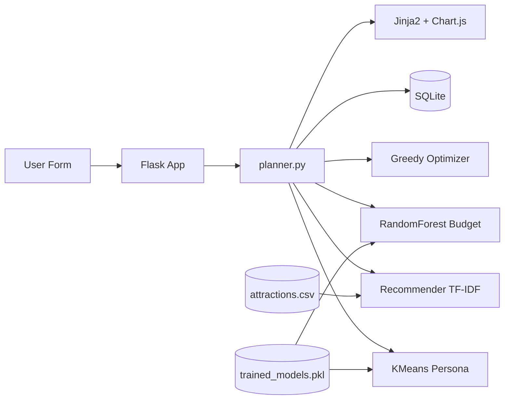

# Smart Travel Planner

An AI-powered web application that generates personalized Vietnam travel itineraries using **Flask**, **scikit-learn**, and a local **CSV dataset** — no external APIs required.


## Introduction

Smart Travel Planner helps users plan multi-day trips across Vietnamese cities by combining:

- **Content-based recommendations** (TF-IDF + cosine similarity)
- **User clustering** (KMeans → Backpacker, Explorer, Luxury Traveler, Foodie)
- **Budget prediction** (RandomForestRegressor)
- **Greedy route optimization** with category diversity

## Features

- Personalized day-by-day itinerary (Morning / Afternoon / Evening)
- Attraction details: name, category, rating, cost, duration, description
- Traveler persona detection
- Trip quality score (0–100)
- Smart budget warnings
- Live recommendation preview (AJAX)
- Regenerate itinerary with varied routing
- Chart.js budget and category analytics
- SQLite trip history
- Responsive Bootstrap 5 UI
- **i18n** — English / Vietnamese language switcher (session + cookie)

## Technologies

| Layer | Stack |
|-------|--------|
| Backend | Python, Flask |
| Frontend | HTML5, CSS3, Bootstrap 5, JavaScript, jQuery, Jinja2 |
| ML | scikit-learn, pandas, numpy, joblib |
| Database | SQLite |
| Charts | Chart.js |
| Data | `datasets/attractions.csv` (120+ places) |

## Project Structure

```
smart_travel_planner/
├── app.py                 # Flask routes
├── requirements.txt
├── README.md
├── datasets/
│   └── attractions.csv
├── models/
│   └── trained_models.pkl
├── data/
│   └── travel_planner.db
├── static/
│   ├── css/style.css
│   ├── js/main.js, charts.js
│   └── images/
├── templates/
│   ├── layout.html
│   ├── index.html
│   └── result.html
├── utils/
│   ├── recommender.py     # TF-IDF + scoring
│   ├── clustering.py      # KMeans personas
│   ├── optimizer.py       # Greedy routing
│   ├── predictor.py       # Random Forest budget
│   ├── planner.py         # Pipeline orchestration
│   └── ...
├── scripts/
│   ├── generate_dataset.py
│   └── train_models.py
└── notebooks/
    └── training.ipynb
```

## Architecture



**Recommendation score:**

```
score = 0.4×interest_match + 0.3×rating + 0.2×budget_fit + 0.1×popularity
```

## Installation

### Prerequisites

- Python 3.10 or newer
- pip

### Steps

```bash
# Clone or enter project directory
cd SmartTravelPlanner

# Create virtual environment (recommended)
python -m venv venv
venv\Scripts\activate        # Windows
# source venv/bin/activate   # macOS/Linux

# Install dependencies
pip install -r requirements.txt

# Generate dataset (if missing)
python scripts/generate_dataset.py

# Train ML models
python scripts/train_models.py
```

## Usage

```bash
python app.py
```

Open **http://127.0.0.1:5000** in your browser.

1. Select city, days, budget, interests, and travel style
2. Click **Generate Itinerary** or **Preview Recommendations**
3. View dashboard, charts, timeline, and budget analysis
4. Use **Regenerate Itinerary** for a new route variant
5. Switch language via **EN / VI** in the navbar (persists across visits)

### Internationalization (i18n)

- Supported locales: `en` (English), `vi` (Vietnamese)
- Route: `GET /set-language/<en|vi>` — stores preference in session + cookie
- Translation files: `utils/locales/en.py`, `utils/locales/vi.py`
- Templates use `{{ _('key') }}`; filters: `t_style`, `t_interest`, `t_category`, `t_persona`, `t_period`

### API Endpoint

`POST /recommendations` — JSON preview of top recommended places (same form fields as main form).

## Screenshots

> Placeholder — add screenshots after running the app:

| Home | Results |
|------|---------|
| `docs/screenshots/home.png` | `docs/screenshots/result.png` |

## Notebook

Open `notebooks/training.ipynb` for:

- EDA and preprocessing
- TF-IDF vectorization
- KMeans clustering visualization
- Random Forest training and evaluation
- Heatmaps and charts
- Model export via joblib

## Cities & Categories

**Cities:** Da Lat, Ho Chi Minh, Ha Noi, Da Nang, Nha Trang  

**Categories:** cafe, nature, museum, food, nightlife, beach, shopping, adventure

## License

Educational / portfolio project — free to use and modify.
